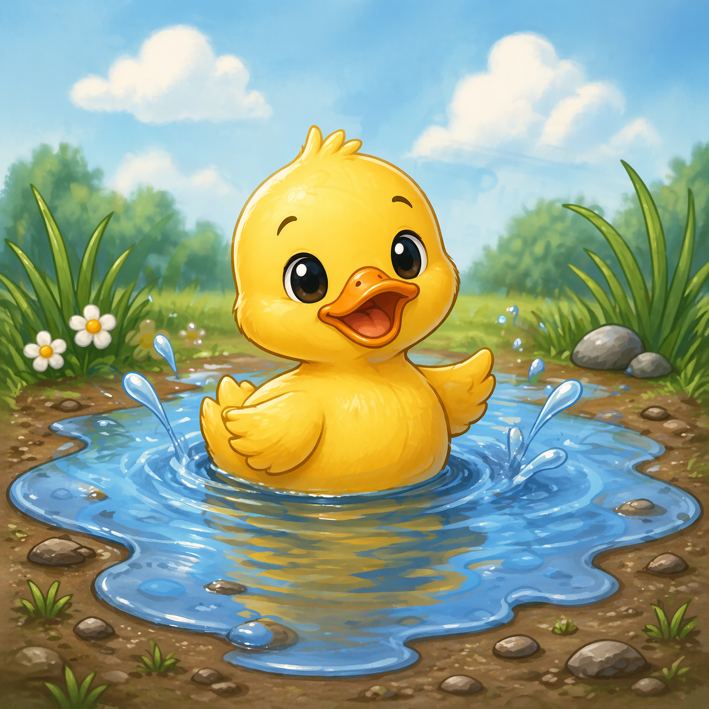

# 🦆 Puddle Programming Language



---

## Name of the Language

**Puddle**

---

## Language Overview

Puddle is a simple, educational programming language designed to help students understand how programming languages work internally. It introduces core concepts such as:

- Custom syntax design (e.g., `quack` instead of `print`)
- Grammar rules using EBNF
- Tokenization and parsing
- Abstract Syntax Trees (ASTs)
- Basic interpretation of code

The language enforces strict rules to make parsing predictable, such as requiring all variable names to begin with the letter **Q**. Filenames for this language have an extension of ".pud"

Puddle is intentionally minimal and is used as a teaching tool rather than a production language.

---

## 💻 Example Code Snippet

```puddle
~ This is a comment
let Qx = 2;
let Qy = 3;
let Qmessage = ,,,Hello from Puddle,,,

quack(Qx);
quack(Qy);
quack(Qmessage);
quack(,,,Direct output!,,,);
```
## Syntax

| Feature              | Syntax Example          | Notes                  |
| -------------------- | ----------------------- | ---------------------- |
| Variable Declaration | `let Qx = 2;`           | Must start with `Q`    |
| String Literal       | `,,,Hello,,,`           | Uses triple commas     |
| Output Statement     | `quack(Qx);`            | Equivalent to print    |
| Identifier Rule      | `Qname`, `Q1`, `Qvalue` | Must start with `Q`    |
| Number Literal       | `123`                   | Integers only          |
| Statement Ending     | `;`                     | Required               |
| Parentheses          | `( )`                   | Used in function calls |
| Comments             | `~ comment`            | Single-line comments   |

## Grammars

\<program\>              ::= { \<statement\> }

\<statement\>            ::= \<variable_declaration\>
                         | \<quack_statement\>
                         | \<comment\>

\<variable_declaration\> ::= "let" \<identifier\> "=" \<expression\> ";"

\<quack_statement\>      ::= "quack" "(" \<expression\> ")" ";"

\<expression\>           ::= \<term\> | \<term\> "+" \<term\>

\<term\>                 ::= \<identifier\>
                         | \<number_literal\>
                         | \<string_literal\>

\<identifier\>           ::= "Q" { \<letter\> | \<digit\> }

\<number_literal\>       ::= \<digit\> { \<digit\> }

\<string_literal\>       ::= ",,," { \<character\> } ",,,"

\<comment\>              ::= "~" { \<character\> }

## Group Members
1. Professor Petcaugh


